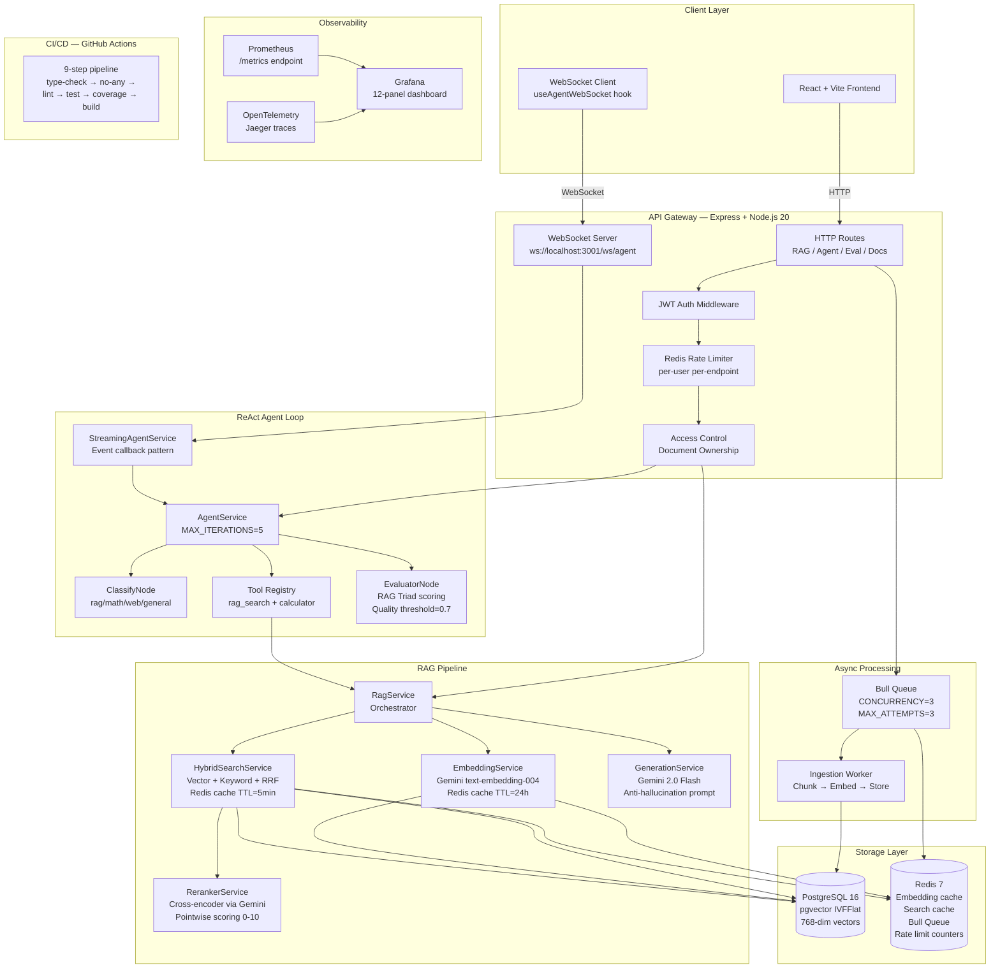

# Research Assistant Platform — Architecture Document

**Version**: 1.0  
**Date**: May 2026  
**Author**: [Your Name]  
**Repository**: https://github.com/darunbjork/research-assistant-platform

---

## 1. System Overview

The Research Assistant Platform is a production-grade
Retrieval-Augmented Generation (RAG) system that enables users to
upload documents and receive grounded, cited answers from an autonomous
AI agent. The system combines hybrid search (vector + keyword),
cross-encoder reranking, self-correcting agent loops, and real-time
WebSocket streaming to deliver answers that are both accurate and
transparent.

**Scale targets:**
- 50 concurrent users
- Sub-3-second P95 latency for RAG queries (cached)
- 640+ unit tests, 82% line coverage
- Zero-downtime deployments via GitHub Actions CI/CD

---

## 2. Architecture Diagram

---

## 3. Request Lifecycle — End to End

### 3a. RAG Query (POST /api/v1/rag/query)