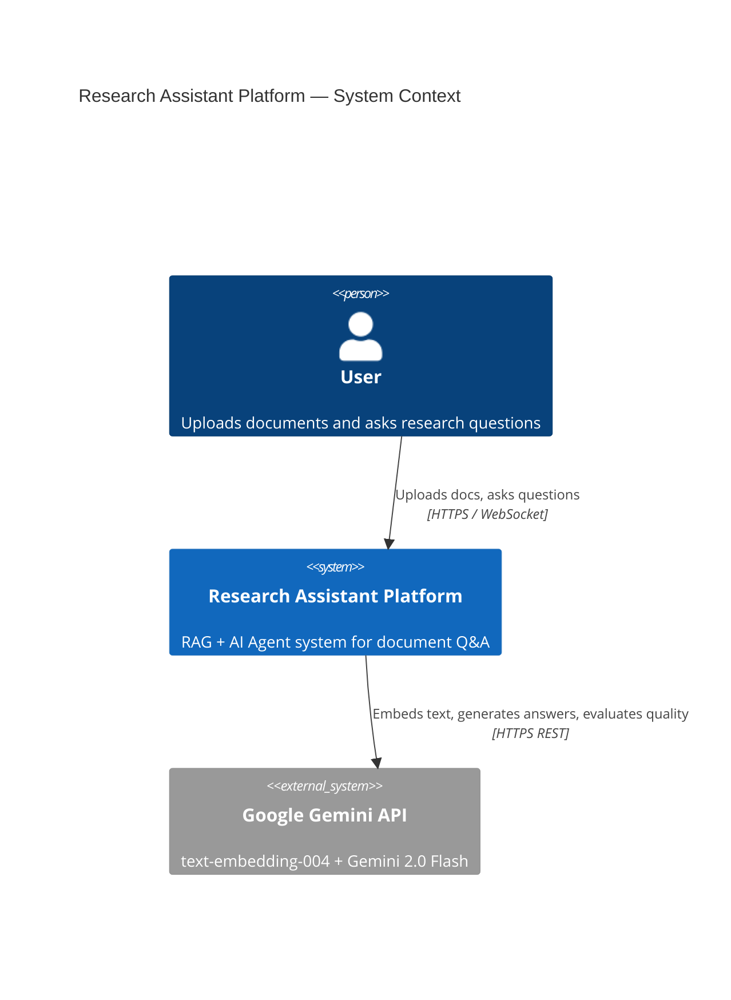
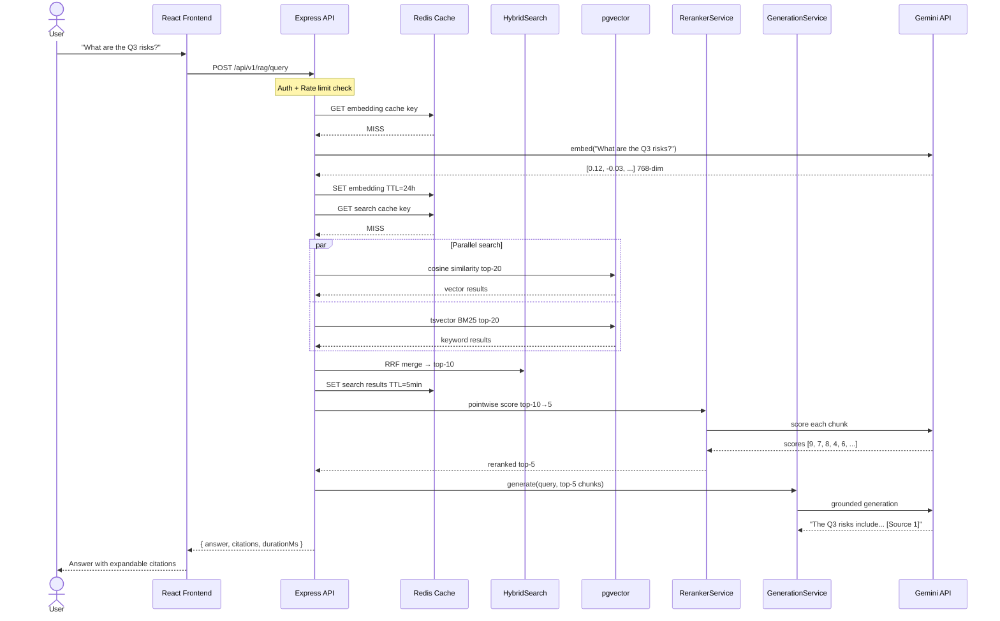
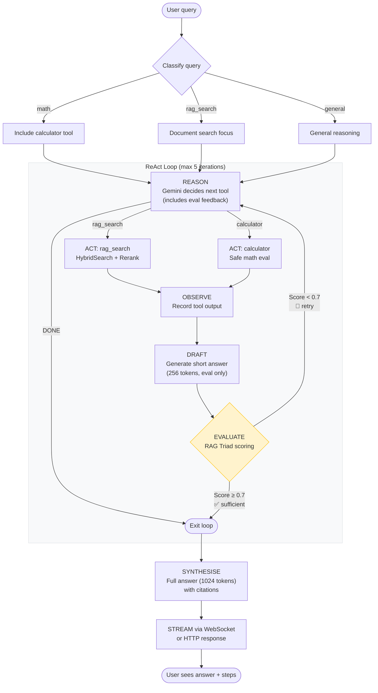

# System Diagram — Research Assistant Platform

## High-Level Architecture



## Container Diagram

```mermaid
C4Container
  title Research Assistant Platform — Containers

  Person(user, "User", "Browser or mobile")

  Container(frontend, "React Frontend", "React 18 + Vite + Tailwind",
    "Chat UI, document upload, agent steps, eval widget")
  
  Container(backend, "API Server", "Node.js 20 + Express + TypeScript",
    "HTTP REST API + WebSocket server. JWT auth, rate limiting, RAG pipeline")
  
  ContainerDb(postgres, "PostgreSQL 16 + pgvector",
    "Document storage, 768-dim vector search, full-text search (tsvector)")
  
  ContainerDb(redis, "Redis 7",
    "Embedding cache (24h TTL), search cache (5min TTL), Bull Queue, rate limit counters")
  
  Container(grafana, "Grafana", "Grafana 10",
    "12-panel monitoring dashboard. Latency, quality, cache, memory panels")
  
  Container(prometheus, "Prometheus", "Prometheus 2.48",
    "Time-series metrics storage. Scrapes /metrics every 15s")

  Rel(user, frontend, "Uses", "HTTPS")
  Rel(frontend, backend, "API calls", "HTTPS + WebSocket")
  Rel(backend, postgres, "Reads/writes", "Prisma ORM")
  Rel(backend, redis, "Cache + queue", "ioredis")
  Rel(backend, gemini, "Embed + generate", "fetch() HTTPS")
  Rel(prometheus, backend, "Scrapes metrics", "HTTP GET /metrics")
  Rel(grafana, prometheus, "Queries", "PromQL")
```

## RAG Pipeline — Sequence Diagram



## Agent ReAct Loop — Flow Diagram

